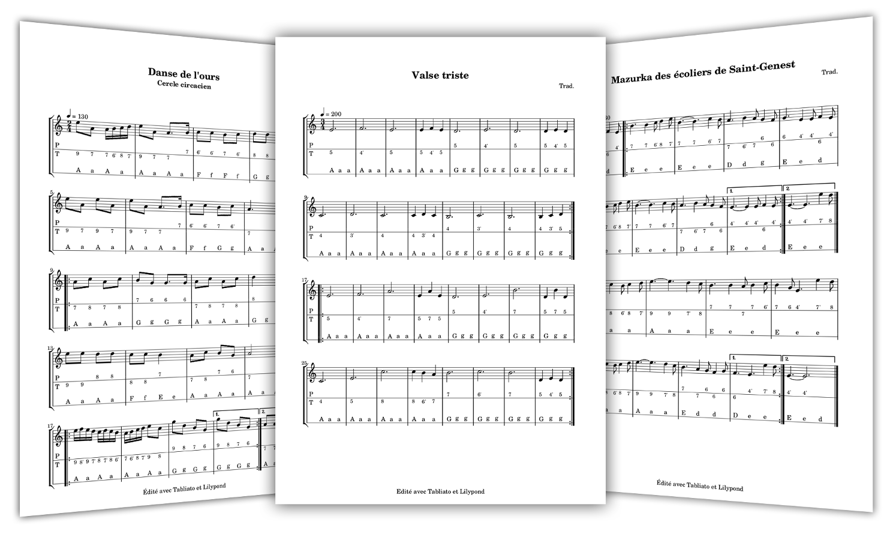

# Tabliato

[Tabliato](https://jean-romain.github.io/tabliato/) est un logiciel pour GNU/Linux et Windows permettant d'écrire des tablatures d'accordéon diatonique de grande qualité aux formats CADB ou Cogeron. [Télécharger Tabliato](https://jean-romain.github.io/tabliato/download.html)

[](https://jean-romain.github.io/tabliato/)

## Compilation

```
sudo apt-get install qtbase5-dev lilypond timidity timidity-interfaces-extra freepats libpoppler-qt5-dev qtmultimedia5-dev
qmake
make
```
